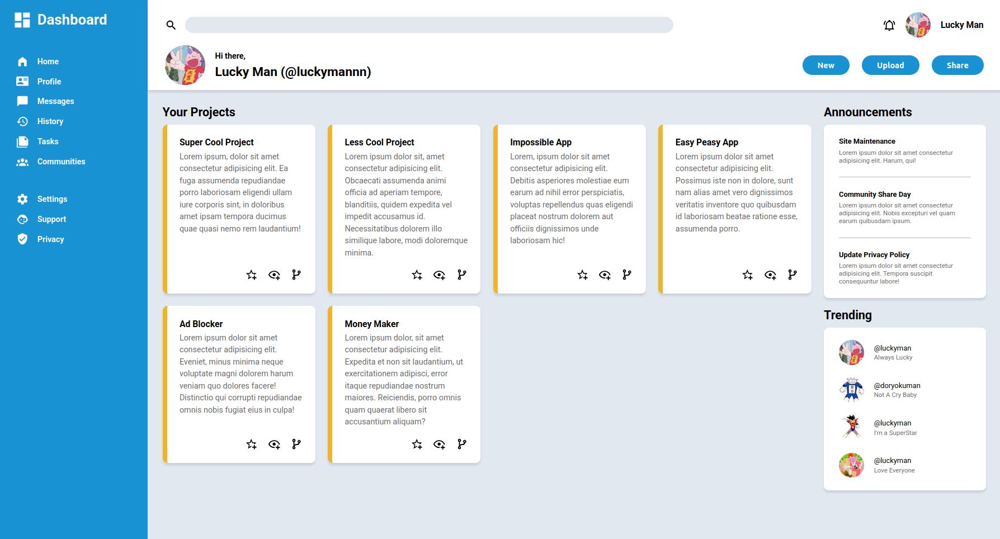

# Admin Dashboard - The Odin Project

This is a responsive admin dashboard layout built from scratch using HTML and CSS. This project focuses heavily on **CSS Grid** to manage a complex, multi-column interface, demonstrating how to handle distinct layout areas like sidebars, headers, and content grids without relying on external frameworks.

***

## Screenshot

## Live Demo

You can access it here: https://laym00n.github.io/odin-admin-dashboard/

## Features

* **Full Grid Architecture:** Unlike typical flexbox layouts, this project uses `display: grid` for the entire page structure (Sidebar vs. Main Content) and even for internal component alignment (Search bar, User info).

* **Responsive Project Grid:** The "Your Projects" section uses `repeat(auto-fit, minmax(...))` to automatically adjust the number of columns based on the available screen width.

* **Static Sidebar & Header:** Implements a classic dashboard structure with a vertical navigation bar spanning the full height and a header section containing search and user controls.

* **Card Design Pattern:**
    * **Projects:** Features a distinct "card" look with a colored accent border (`border-left`) and action icons.
    * **Announcements & Trending:** Utilizes stacking contexts and borders to group related information cleanly.

* **Visual Polish:**
    * Uses `box-shadow` on the header and cards to create depth and separation from the background.
    * Implements `object-fit: cover` to ensure user avatars remain perfectly circular without distortion.

## Technologies Used

1.  **HTML5:** Used semantic structure with mostly `
` containers organized by class names for the grid areas.

2.  **CSS3:** Handled all styling, specifically focusing on:
    * **CSS Grid:** The primary layout engine used for `grid-template-columns`, `grid-template-rows`, and defining `grid-column` spans for the sidebar and header.
    * **Typography:** Integrated **Roboto** via Google Fonts for a clean, modern interface text.
    * **SVG Icons:** Implemented inline SVGs for navigation, actions, and status icons, styled directly with CSS fill and sizing.
    * **Box Model:** Detailed use of padding and margins to create whitespace, along with specific border radii for a softer UI look.